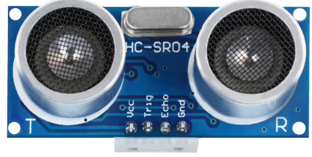
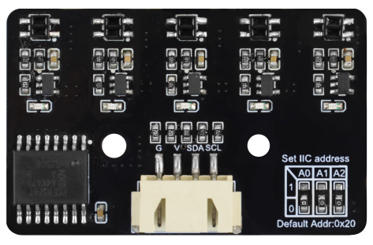
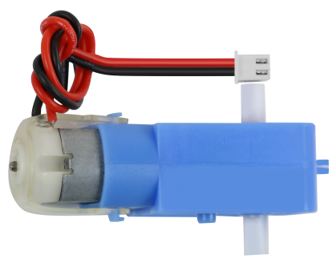
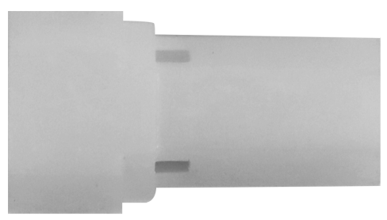
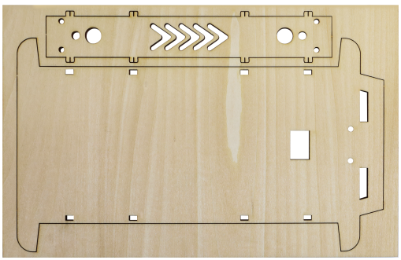
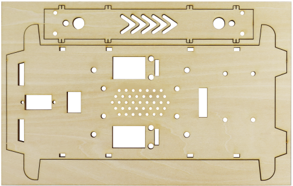
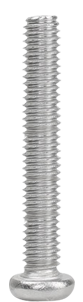
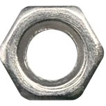
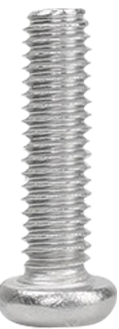
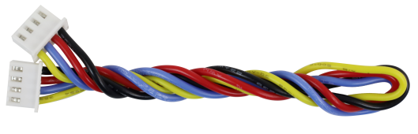

## 1. 产品介绍

本项目是一款基于 **ESP32-S3** 主控芯片的智能 AI 语音交互小车。通过集成高灵敏度麦克风模块和喇叭，小车能够识别用户的语音指令并进行实时对话或执行动作；配合直流减速电机、巡线传感器和超声波避障模块，它具备了自主移动的能力。

*   **主控**：采用 ESP32-S3 双核处理器，支持 Wi-Fi 和蓝牙 5.0，算力强大，完美支持 AI 语音处理库。
*   **AI 语音交互**：内置麦克风与喇叭，支持语音唤醒、语音识别及 TTS（文字转语音）播报，实现真正的“聊天”功能。
*   **多模式运动**：支持前进、后退、左转、右转基础运动，以及自动巡线和智能避障高级功能。
*   **图形化编程友好**：专为 KidsBlock 图形化编程环境优化，无需编写复杂代码，拖拽积木即可实现创意功能。
*   **扩展性强**：预留 GPIO 接口，方便后续拓展外设。

> **[此处插入产品整体效果图：展示组装完成的小智 AI 小车全景]**

---

###  套件清单                                                                                                                                                                                                                                                                                            

|               模块名称               |                             图片                             | 数量 |
| :----------------------------------: | :----------------------------------------------------------: | :--: |
|              超声波模块              |                        |  1   |
|            5路巡线传感器             |                        |  1   |
|               180舵机                |                        |  1   |
|                 电机                 |                        |  4   |
|         麦克纳姆轮全向轮 A轮         |                        |  4   |
|         麦克纳姆轮全向轮 B轮         |                        |      |
|                联轴器                |                        |  4   |
|               蓝色外壳               |                        |  1   |
|                电池盒                |                        |  1   |
|                 木板                 |  |  2   |
|                M2螺母                |                        |  3   |
|         M2*8MM 圆头 十字螺钉         |                        |  3   |
|         M3*6MM 平头 十字螺钉         |                        |  7   |
|        M3*30MM 圆头 十字螺钉         |                        |  9   |
|                M3螺母                |                        |  16  |
|     M2.3*16MM 圆头十字 自攻螺钉      |                        |  5   |
|         M4*8MM 圆头 十字螺钉         |                        |  9   |
|         M4*20MM 双通六角铜柱         |                        |  5   |
| 4P 双头XH2.54插头 L=200mm 白色连接线 |                        |  1   |
| 4P XH-2.54mm 22AWG 200mm 黑红蓝黄线  |                        |  1   |