# 4.项目教程

资料下载

 [code](code.7z) 

## 4.1 小车驱动

在这一课中，我们将学习如何通过代码控制小车的运动。我们将基于 ESP32 主控板，利用 **Mecanum（麦克纳姆轮）** 驱动逻辑，实现小车的前进、后退、左转和右转。

> **前置准备**：
> 1. 已组装好的 AI 小车硬件。
> 2. 已安装 KidsBlock 软件。

### 4.1.1 麦克纳姆轮是如何运动的

与普通的四轮小车不同，麦克纳姆轮可以通过四个轮子不同方向和速度的组合，实现全向移动。在本教程的代码逻辑中，我们定义了以下运动模式：

- **前进 (Forward)**：四个轮子同时向前转。
- **后退 (Backward)**：四个轮子同时向后转。
- **左转 (Turn Left)**：右侧轮子向前，左侧轮子向后（原地旋转）。
- **右转 (Turn Right)**：左侧轮子向前，右侧轮子向后（原地旋转）。

### 4.1.2 代码解析

#### 电机控制函数

在代码中，初始化电机引脚：

控制方向与速度：

#### MCP 工具调用

这是本课程的重点。我们不是写死"一直前进"，而是让 **AI 大脑** 来决定小车怎么动。

代码中注册了一个 MCP 工具：

当用户对 AI 说"前进"时，AI 会解析意图，并调用这个工具，传入动作（action）和速度（speed）。

#### OnMcpControl 回调函数

当 AI 决定控制小车时，`OnMcpControl` 函数会被触发。我们需要在这里编写逻辑，根据 AI 传来的指令执行相应的动作。

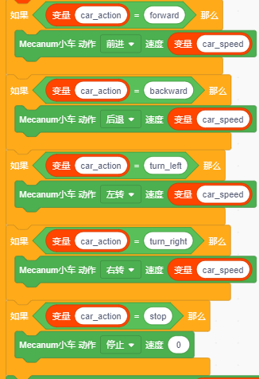

#### 逻辑详解

1. **获取指令**：从 `param` 中提取 `action`（动作）和 `speed`（速度）。
2. **判断动作**：
   - 如果是 `"forward"`：小车前进
   - 如果是 `"backward"`：小车后退
   - 如果是 `"turn_left"`：小车左转
   - 如果是 `"turn_right"`：小车右转
   - 如果是 `"strafe_left"`：小车左横移
   - 如果是 `"strafe_right"`：小车右横移
   - 如果是 `"diag_fw_left"`：小车左前斜移
   - 如果是 `"diag_fw_right"`：小车右前斜移
   - 如果是 `"diag_bw_left"`：小车左后斜移
   - 如果是 `"diag_bw_right"`：小车右后斜移
   - 如果是 `"stop"`：所有轮子速度设为 0。
3. **执行驱动**：小车执行对应的速度和动作。

---

### 4.1.3 小车测试

现在，我们将通过语音或调试工具测试小车的运动功能。

#### 步骤 1：烧录代码

将包含上述逻辑的代码烧录到开发板中。

#### 步骤 2：联网与激活

确保小车连接 Wi-Fi 并成功连接到 AI 服务器。

#### 步骤 3：语音控制测试

用"你好小智"唤醒后，对着小车说出以下指令，观察小车反应：

| 用户指令 | 底层逻辑 | 表现 |
|---|---|---|
| "小车前进" | action=forward：四轮同向正转 | 小车前进 |
| "小车后退" | action=backward：四轮同向反转 | 小车后退 |
| "向左转" | action=turn_left：左轮反转、右轮正转 | 原地左转 |
| "向右转" | action=turn_right：左轮正转、右轮反转 | 原地右转 |
| "向左平移" | action=strafe_left：麦轮横向滚动 | 小车整体向左平移 |
| "向右平移" | action=strafe_right：麦轮横向滚动 | 小车整体向右平移 |
| "向左前方行驶" | action=diag_fw_left：麦轮对角驱动 | 向左前方斜向行驶 |
| "向右前方行驶" | action=diag_fw_right：麦轮对角驱动 | 向右前方斜向行驶 |
| "向左后方行驶" | action=diag_bw_left：麦轮对角驱动 | 向左后方斜向行驶 |
| "向右后方行驶" | action=diag_bw_right：麦轮对角驱动 | 向右后方斜向行驶 |
| "停下" | action=stop：四轮 PWM 设为 0 | 小车停止 |
| "将速度设置为150" | speed=150：车轮 PWM 调整至 150 | 车速变化 |

提示：速度可调范围为 0-255。

## 4.2 避障小车

在本节课中，我们将为 AI 小车赋予"眼睛"和"大脑"，让它能够：

1. **感知环境**：使用超声波传感器检测前方障碍物。
2. **自主决策**：当发现障碍物时，自动停车、观察左右距离。
3. **智能避让**：根据左右空间的宽窄，自动选择最佳路径继续前进。

> **前置准备**：
> 1. 已组装好的 AI 小车硬件（含超声波传感器与舵机）。
> 2. 已安装 KidsBlock 软件。
> 3. 已完成 4.1 的学习，掌握小车基本驱动方法。

### 4.2.1 避障核心逻辑解析

为了实现流畅的避障，我们不能简单地"遇到障碍就停"，而是需要一套完整的**状态机逻辑**。我们将避障过程分解为以下几个步骤（对应代码中的 `obsStep` 变量）：

1. **巡航状态 (Step 0)**：正常前进，实时监测前方距离。
2. **发现障碍 (Step 1)**：距离小于阈值（如 20cm），立即停车，准备扫描。
3. **向左看 (Step 1-2)**：控制舵机转到左侧（180度），测量左边距离 `distance_L`。
4. **向右看 (Step 3-4)**：控制舵机转到右侧（0度），测量右边距离 `distance_R`。
5. **决策转向 (Step 5)**：舵机回中（90度），比较 `distance_L` 和 `distance_R`，哪边宽敞往哪边转。
6. **恢复巡航 (Step 6)**：转向执行一段时间后，重置状态，回到 Step 0 继续前进。

### 4.2.2 代码解析

#### 初始化变量与引脚

首先，我们需要定义一些全局变量来记录小车的状态和传感器数据。

- **避障开关 (`obstacle_enabled`)**：决定是否开启自动避障模式。
- **状态步骤 (`obsStep`)**：记录当前处于避障流程的哪一步。
- **距离变量**：存储前方、左方、右方的距离数据。
- **时间记录**：用于非阻塞式的延时控制（避免使用 `delay` 导致程序卡死）。

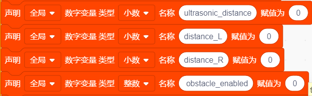

#### 配置 MCP 工具（让 AI 能控制避障）

为了让语音助手能开启或关闭避障功能，我们需要注册一个 MCP 工具。

- **工具名称**：`self.avoidance.set`

- **参数**：`state`（字符串："on" 或 "off"）
- **执行逻辑**：
  - 如果收到 "on"：设置 `obstacle_enabled = 1`，并进入手动伺服模式以便后续扫描。
  - 如果收到 "off"：设置 `obstacle_enabled = 0`，重置所有状态，停止小车。

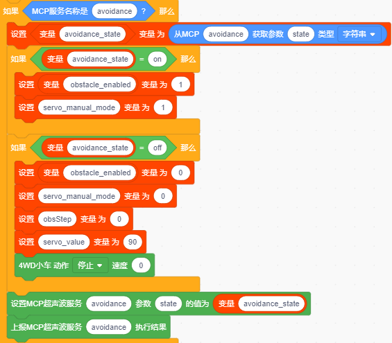

#### 编写主循环中的避障状态机

这是本节课的核心。在主循环或专门的避障逻辑函数块中编写以下逻辑。我们使用  来获取当前时间，通过计算时间差（`elapsed`）来控制动作持续时间，而不是使用阻塞式的代码块。

#### 1. 巡航监测 (Step 0)

当 `obsStep == 0` 时：

- 读取超声波前方距离。
- **判断**：如果距离 > 0 且 < 20cm（有障碍）：
  - **动作**：四轮 PWM 设为 0（停车）。
  - **状态**：`obsStep` 变为 1，记录当前时间 `lastActionTime`。
- **否则**（无障碍）：
  - **动作**：四轮正转，速度设为 150（前进）。

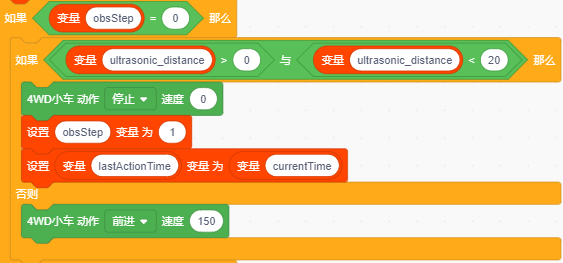

#### 2. 准备向左扫描 (Step 1)

当 `obsStep == 1` 时：

- **判断**：如果 `当前时间 - lastActionTime > 500ms`（等待小车完全停稳）：
  - **动作**：舵机写入角度 180（向左看）。
  - **状态**：`obsStep` 变为 2，更新 `lastActionTime`。

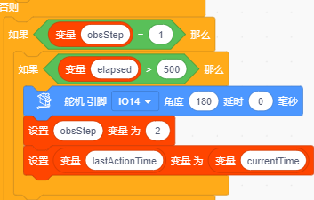

#### 3. 测量左侧距离 (Step 2)

当 `obsStep == 2` 时：

- **判断**：如果 `当前时间 - lastActionTime > 500ms`（等待舵机转动到位）：
  - **动作**：读取超声波距离，赋值给 `distance_L`。
  - **状态**：`obsStep` 变为 3，更新 `lastActionTime`。

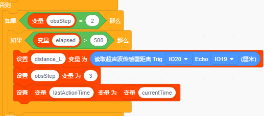

#### 4. 准备向右扫描 (Step 3)

当 `obsStep == 3` 时：

- **判断**：如果 `当前时间 - lastActionTime > 500ms`：
  - **动作**：舵机写入角度 0（向右看）。
  - **状态**：`obsStep` 变为 4，更新 `lastActionTime`。

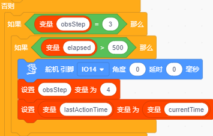

#### 5. 测量右侧距离 (Step 4)

当 `obsStep == 4` 时：

- **判断**：如果 `当前时间 - lastActionTime > 500ms`：
  - **动作**：读取超声波距离，赋值给 `distance_R`。
  - **状态**：`obsStep` 变为 5，更新 `lastActionTime`。

#### 6. 决策与转向 (Step 5)

当 `obsStep == 5` 时：

- **判断**：如果 `当前时间 - lastActionTime > 500ms`：
  - **动作 1**：舵机写入角度 90（回中）。
  - **动作 2（核心决策）**：
    - 如果 `distance_L < distance_R`（右边更宽）：**右转**（左轮正转，右轮反转）。
    - 否则（左边更宽或相等）：**左转**（左轮反转，右轮正转）。
  - **状态**：`obsStep` 变为 6，更新 `lastActionTime`。

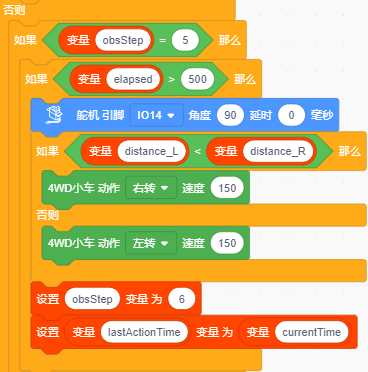

#### 7. 恢复巡航 (Step 6)

当 `obsStep == 6` 时：

- **判断**：如果 `当前时间 - lastActionTime > 1000ms`（转向持续 1 秒）：
  - **状态**：`obsStep` 重置为 0，更新 `lastActionTime`。
  - 注：下一个循环进入 Step 0 时，会自动重新开始前进。

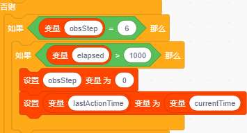

---

### 4.2.3 小车测试

现在，我们将通过语音或调试工具测试小车的运动功能。

#### 步骤 1：烧录代码

将包含上述逻辑的代码烧录到开发板中。

#### 步骤 2：联网与激活

确保小车连接 Wi-Fi 并成功连接到 AI 服务器。

#### 步骤 3：语音控制测试

用"你好小智"唤醒后，对着小车说出以下指令，观察小车反应：

| 用户指令 | 底层逻辑 | 表现 |
|---|---|---|
| "小车前进" | action=forward：四轮同向正转 | 小车前进 |
| "小车后退" | action=backward：四轮同向反转 | 小车后退 |
| "向左转" | action=turn_left：左轮反转、右轮正转 | 原地左转 |
| "向右转" | action=turn_right：左轮正转、右轮反转 | 原地右转 |
| "向左平移" | action=strafe_left：麦轮横向滚动 | 小车整体向左平移 |
| "向右平移" | action=strafe_right：麦轮横向滚动 | 小车整体向右平移 |
| "向左前方行驶" | action=diag_fw_left：麦轮对角驱动 | 向左前方斜向行驶 |
| "向右前方行驶" | action=diag_fw_right：麦轮对角驱动 | 向右前方斜向行驶 |
| "向左后方行驶" | action=diag_bw_left：麦轮对角驱动 | 向左后方斜向行驶 |
| "向右后方行驶" | action=diag_bw_right：麦轮对角驱动 | 向右后方斜向行驶 |
| "停下" | action=stop：四轮 PWM 设为 0 | 小车停止 |
| "将速度设置为150" | speed=150：车轮 PWM 调整至 150 | 车速变化 |
| "打开避障模式" | 避障使能设为 1，进入避障状态机 | 遇到障碍停下、左右测距、选择宽敞方向行驶 |
| "关闭避障模式" | 避障使能设为 0，重置状态并停车 | 停止避障 |

提示：

1. 如果小车没有执行对应的动作，可点击复位键 RESET 重启重新尝试一遍。
2. 打开避障模式时，无法通过语音更改速度。

### 4.2.4 关键知识点总结

1. **非阻塞式编程**：
   - ❌ 错误做法：使用 。这会让整个程序（包括 WiFi 连接、语音监听)暂停 1 秒，导致阻塞运行。
   - ✅ 正确做法：使用  记录时间点，通过 `if (currentTime - lastTime > duration)` 来判断时间是否到达。这样在等待舵机转动或超声波测距时，后台依然可以处理网络数据和语音指令。
2. **状态机**：
   - 通过 `obsStep` 变量将复杂的避障动作拆解为一个个小步骤。每一步只做一个简单的动作（如"转头"、"测距"、"比较"），使得逻辑清晰且易于调试。
3. **超声波测距原理**：
   - 发送触发信号（Trig High 10us）→ 接收回响信号（Echo）→ 计算高电平持续时间 → 转换为距离（`duration * 0.034 / 2`）。

## 4.3 巡线小车

在本节课中，我们将赋予小车"眼睛"和"大脑"，让它能够识别地面的黑线并自动沿着路径行驶。你将学习到：

1. **传感器原理**：理解五路红外巡线传感器是如何工作的。
2. **运动控制**：结合麦克纳姆轮的特性，实现平滑的纠偏动作。
3. **AI 交互**：通过语音指令开启或关闭巡线模式。

> **前置准备**：
> 1. 已组装好的 AI 小车硬件（含五路红外巡线传感器）。
> 2. 已安装 KidsBlock 软件。
> 3. 已完成 4.1 的学习，掌握小车基本驱动方法。

### 4.3.1 巡线核心逻辑解析

巡线的核心思想是：**"发现偏离 → 纠正方向"**。

我们的传感器有 5 个探头（从左到右编号为 L2、L1、C、R1、R2）。

- **白色地面**：反射率高，传感器返回 `1`。
- **黑色线条**：吸收光线，传感器返回 `0`。

### 4.3.2 代码解析

#### 初始化与变量设置

初始化循迹模块：

定义巡线状态变量：

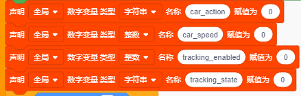

#### 注册 MCP 工具（让 AI 能控制巡线）

我们需要让 AI 知道如何控制巡线开关。在代码中，我们已经定义了 `self.line_track.set` 这个工具。

在图形化界面中，确保注册了以下事件监听：

- 当收到 MCP 调用 `self.line_track.set` 时：
  - 获取参数 `state`。
  - 如果 `state` 是 "on"，将变量 `巡线使能` 设为 1。
  - 如果 `state` 是 "off"，将变量 `巡线使能` 设为 0，并调用 `停车`。

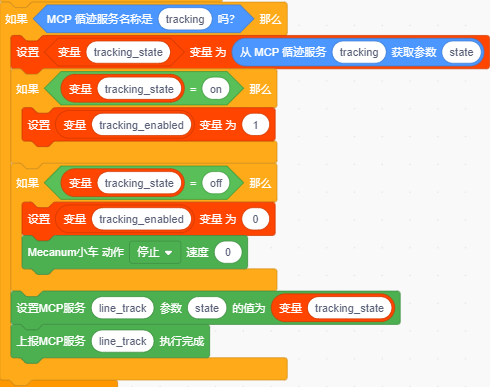

#### 定义巡线行为函数

#### 1. 基础状态判断

我们需要不断读取传感器的值。最理想的状态是**中间探头 (C)** 检测到黑线，其他探头检测到白地。这时小车应该**直线前进**。

#### 2. 轻微偏离纠偏

如果小车稍微偏左，**右侧内探头 (R1)** 会压到黑线；如果稍微偏右，**左侧内探头 (L1)** 会压到黑线。

- **偏左时**：我们需要向右转一点。对于麦克纳姆轮，可以通过让右侧轮子加速或左侧轮子减速/反转来实现小幅右转。
- **偏右时**：我们需要向左转一点。

#### 3. 严重偏离纠偏

如果小车偏离较大，**外侧探头 (L2 或 R2)** 会检测到黑线。这时候需要更大幅度的转向。

- **严重偏左 (L2 检测到黑线)**：执行大幅右转。
- **严重偏右 (R2 检测到黑线)**：执行大幅左转。
- **完全丢失线条**：如果所有探头都是白色，或者只有边缘探头偶尔闪烁，为了安全起见，小车应该**停止**，等待下一步指令或重新寻找线条。

---

### 4.3.3 小车测试

现在，我们将通过语音或调试工具测试小车的运动功能。

#### 步骤 1：烧录代码

将包含上述逻辑的代码烧录到开发板中。

#### 步骤 2：联网与激活

确保小车连接 Wi-Fi 并成功连接到 AI 服务器。

#### 步骤 3：语音控制测试

用"你好小智"唤醒后，对着小车说出以下指令，观察小车反应：

| 用户指令 | 底层逻辑 | 表现 |
|---|---|---|
| "小车前进" | action=forward：四轮同向正转 | 小车前进 |
| "小车后退" | action=backward：四轮同向反转 | 小车后退 |
| "向左转" | action=turn_left：左轮反转、右轮正转 | 原地左转 |
| "向右转" | action=turn_right：左轮正转、右轮反转 | 原地右转 |
| "向左平移" | action=strafe_left：麦轮横向滚动 | 小车整体向左平移 |
| "向右平移" | action=strafe_right：麦轮横向滚动 | 小车整体向右平移 |
| "向左前方行驶" | action=diag_fw_left：麦轮对角驱动 | 向左前方斜向行驶 |
| "向右前方行驶" | action=diag_fw_right：麦轮对角驱动 | 向右前方斜向行驶 |
| "向左后方行驶" | action=diag_bw_left：麦轮对角驱动 | 向左后方斜向行驶 |
| "向右后方行驶" | action=diag_bw_right：麦轮对角驱动 | 向右后方斜向行驶 |
| "停下" | action=stop：四轮 PWM 设为 0 | 小车停止 |
| "将速度设置为150" | speed=150：车轮 PWM 调整至 150 | 车速变化 |
| "打开巡线模式" | 巡线使能设为 1，进入巡线逻辑 | 小车在黑线跑道上自动巡线 |
| "关闭巡线模式" | 巡线使能设为 0，并停车 | 停止巡线 |

提示：

1. 如果小车没有执行对应的动作，可点击复位键 RESET 重启重新尝试一遍。
2. 打开巡线模式时，无法通过语音更改速度。

**速度调整**：如果发现小车经常冲出轨道，尝试降低  和左转、右转时的速度值。

## 4.4 综合实战：AI 小车全功能整合

前三课我们分别实现了小车的**驱动控制**、**自动避障**和**自动巡线**。本节课将把这三个功能整合进同一个程序，让小车成为"会听、会看、会走"的完整智能体。你将学习到：

- **顶层模式管理**：用一个状态变量管理小车的运行模式（手动 / 避障 / 巡线）；
- **模块化整合**：把前几课的逻辑块组织进同一个主循环，互不干扰；
- **冲突处理**：多个自动模式不能同时生效，需要设计优先级规则；
- **完整测试流程**：按场景化步骤验证整合后的小车。

> **前置准备**：
> 1. 已完成 4.1、4.2、4.3 的学习，小车驱动、避障、巡线均已调试通过。
> 2. 已安装 KidsBlock 软件。

### 4.4.1 系统总体架构

整合后的小车整体分为四层：

| 层级 | 模块 | 作用 |
|---|---|---|
| 感知层 | 超声波传感器 | 检测前方障碍距离，用于避障模式 |
| 感知层 | 五路红外巡线传感器 | 检测地面黑线，判断是否偏离路线 |
| 决策层 | AI 大脑（语音 + MCP） | 理解语音指令，调用 MCP 工具控制模式开关 |
| 决策层 | 本地模式管理 | 根据模式变量分发主循环逻辑，处理模式互斥 |
| 执行层 | 麦克纳姆轮电机 | 执行前进、后退、转向、停车 |
| 执行层 | 舵机 | 带动超声波传感器左右扫描 |

核心设计思路：

1. **一个主循环，多个逻辑块**：所有功能共用同一个循环，通过时间差实现非阻塞控制（复习 4.2 的知识点）；
2. **模式变量决定行为**：`避障使能` 和 `巡线使能` 两个开关共同决定小车当前执行哪套逻辑；
3. **AI 只负责"下达意图"**：模式切换、动作执行全部由本地逻辑完成，AI 大脑不直接控制电机。

### 4.4.2 模式管理与优先级规则

#### 1. 三种运行模式

| 模式 | 触发条件 | 小车行为 |
|---|---|---|
| 手动模式 | 避障使能 = 0 且 巡线使能 = 0 | 响应"前进" / "后退" / "左转" / "右转" / "停下" / "调速" |
| 避障模式 | 避障使能 = 1 | 自动巡航避障（4.2 状态机），忽略手动方向指令 |
| 巡线模式 | 巡线使能 = 1 | 自动沿黑线行驶（4.3 纠偏逻辑），忽略手动方向指令 |

#### 2. 模式互斥规则（本课新知识点）

避障和巡线都是"自动驾驶"，如果同时开启，两个逻辑块会同时争夺电机控制权，小车行为将不可预测。因此制定两条规则：

**规则一（互斥）**：打开避障模式时，自动关闭巡线模式；打开巡线模式时，自动关闭避障模式。后开启的模式覆盖先开启的模式。

**规则二（手动模式为默认）**：任何自动模式关闭后，小车自动回到手动模式等待指令。

### 4.4.3 代码解析

#### 1. 全局变量初始化

整合程序需要同时管理两套自动驾驶逻辑的状态变量：`避障使能`、`巡线使能`、避障状态机变量 `obsStep`、超声波距离变量（前方 / 左方 / 右方）、巡线传感器数值（L2、L1、C、R1、R2），以及用于非阻塞延时的 `lastActionTime`。

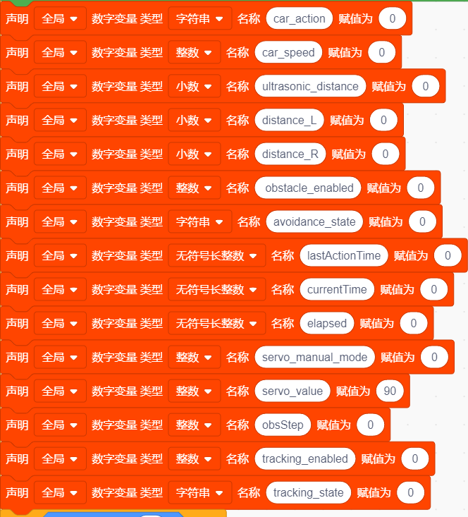

#### 2. MCP 工具回调：模式切换的入口

保持 4.2 和 4.3 注册的工具不变（`self.avoidance.set` 和 `self.line_track.set`），只需在回调逻辑中增加**互斥处理**：

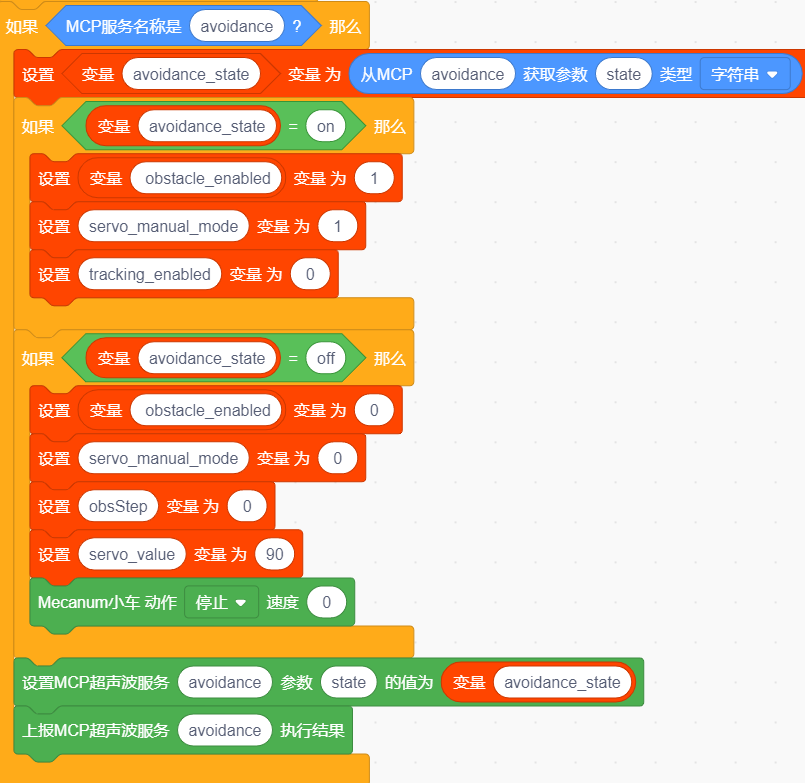

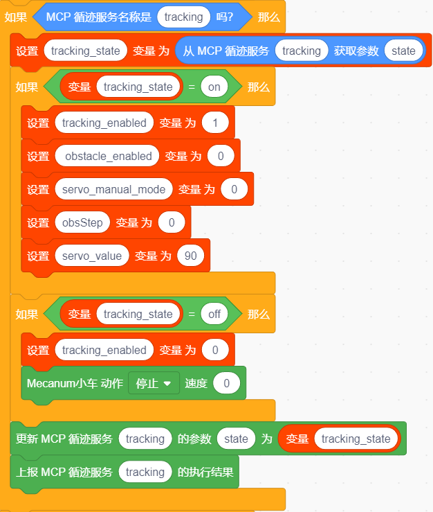

- 打开避障（state 为 "on"）：`避障使能` 设为 1，同时 `巡线使能` 设为 0（互斥：自动关闭巡线）；
- 关闭避障（state 为 "off"）：`避障使能` 设为 0，重置 `obsStep` 状态机，并停车；
- 打开巡线（state 为 "on"）：`巡线使能` 设为 1，同时 `避障使能` 设为 0（互斥：自动关闭巡线）；
- 关闭巡线（state 为 "off"）：`巡线使能` 设为 0，并停车。

#### 3. 主循环模式分发

主循环是整合程序的核心。每轮循环按优先级判断当前模式，分发到对应逻辑块：当 `避障使能` 为 1 时，执行避障状态机（即 4.2 的 obsStep 逻辑）；否则当 `巡线使能` 为 1 时，执行巡线纠偏逻辑（即 4.3 的传感器判断逻辑）；否则等待 AI 手动指令（即 4.1 的电机控制逻辑）。

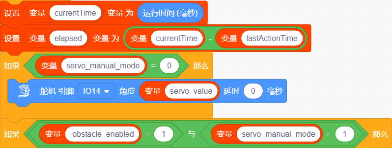

三个逻辑块全部使用 `currentTime - lastActionTime > duration` 的非阻塞方式控制时序，因此无论处于哪个模式，Wi-Fi 连接和语音监听都保持畅通。

---

### 4.4.4 小车测试

#### 步骤 1：烧录代码

将整合后的代码烧录到开发板。

#### 步骤 2：联网与激活

确保小车连接 Wi-Fi 并成功连接到 AI 服务器。

#### 步骤 3：语音控制测试

**测试 A：手动控制（复习 4.1）**

| 用户指令 | 底层逻辑 | 表现 |
|---|---|---|
| "小车前进" | action=forward：四轮同向正转 | 小车前进 |
| "小车后退" | action=backward：四轮同向反转 | 小车后退 |
| "向左转" | action=turn_left：左轮反转、右轮正转 | 原地左转 |
| "向右转" | action=turn_right：左轮正转、右轮反转 | 原地右转 |
| "向左平移" | action=strafe_left：麦轮横向滚动 | 小车整体向左平移 |
| "向右平移" | action=strafe_right：麦轮横向滚动 | 小车整体向右平移 |
| "向左前方行驶" | action=diag_fw_left：麦轮对角驱动 | 向左前方斜向行驶 |
| "向右前方行驶" | action=diag_fw_right：麦轮对角驱动 | 向右前方斜向行驶 |
| "向左后方行驶" | action=diag_bw_left：麦轮对角驱动 | 向左后方斜向行驶 |
| "向右后方行驶" | action=diag_bw_right：麦轮对角驱动 | 向右后方斜向行驶 |
| "停下" | action=stop：四轮 PWM 设为 0 | 小车停止 |
| "将速度设置为150" | speed=150：车轮 PWM 调整至 150 | 车速变化 |

提示：速度可调范围为 0-255。

**测试 B：模式切换与互斥**

| 用户指令 | 底层逻辑 | 表现 |
|---|---|---|
| "打开避障模式" | 避障使能 = 1，巡线使能 = 0 | 遇到障碍停下、左右测距、选择宽敞方向行驶 |
| "打开巡线模式" | 巡线使能 = 1，避障使能 = 0 | 自动巡线（避障自动关闭） |
| "关闭巡线模式" | 巡线使能 = 0，停车 | 停止巡线 |
| "打开避障模式"（巡线中） | 后开的避障覆盖巡线 | 切换到避障行为 |
| "关闭避障模式" | 避障使能 = 0，停车 | 回到手动模式 |

提示：如果小车没有执行对应的动作，可点击复位键 RESET 重启重新尝试一遍。

### 4.4.5 关键知识点总结

**1. 顶层状态机与子状态机**

- 避障模式内部的 `obsStep` 是**子状态机**，负责把复杂动作拆成小步骤；
- 模式变量（`避障使能` / `巡线使能`）是**顶层状态机**，决定小车当前执行哪套逻辑；
- 两层状态机嵌套，是机器人程序最常见的组织方式。

**2. 模式互斥与优先级**

- 多个自动驾驶逻辑不能同时占用电机控制权，必须有明确的互斥规则；
- "后开覆盖先开""关闭自动模式回到手动模式"是简单可靠的默认策略。

**3. 模式切换先复位状态**

- 关闭避障模式时，先重置 `obsStep` 并停车，避免上一模式的残余动作影响下一次开启；
- 每次切换模式前，保证小车处于停止状态，再进入新模式的逻辑。

**4. 非阻塞编程的复用**

- 4.2 学到的 `currentTime - lastActionTime > duration` 写法在整个整合程序中贯穿使用；
- 无论小车处于什么模式，Wi-Fi 和语音监听都不能被 `delay` 卡死。

**5. 模块化分工**

- AI 大脑只负责理解语音意图并调用工具，不直接控制电机；
- 本地程序负责所有安全逻辑、互斥规则和实际执行。以后新增功能时，只需新增一个模式开关和对应的逻辑块。
